# The Pancake Palace
Welcome to the Pancake Palace! The resturant with the best pancakes in Stockholm!

## Table of Content
1. [Introduction](#Introduction)
2. [Features](#Features)
    1. [Favicon](#Favicon)
    2. [Navigation bar](#Navigation-bar)
    3. [Lowernav](#Lower-nav)
    4. [Footer](#Footer)
3. [Technologies](#Technologies)
4. [Pages](#Pages)
    1. [Home](#Home)
    2. [Menu](#Menu)
    3. [About](#About)
    4. [Map](#map)
5. [Features](#features)
6. [Testing](#validation)
    1. [HTML Validation](#HTML-validation)
    2. [CSS Validation](#CSS-validation)
    3. [Accessibility](#accessibility)
    4. [Performance](#performance)
    5. [Device Devices](#Devices)
    6. [Functional Testing](#Functional-Testing)
7. [Acknowledgements](#acknowledgements)

## Introduction

The Pancake Palace is located in the public resturant of the castle in Stockholm Sweden, We have been voted the best pancakes in stockholm for 5 years in a row!

## Features

#### Favicon
* A favicon has been implemented with the resturant logo and can be seen in the nav for each page
* This will allow the users to identify the website when they have multiple websites open

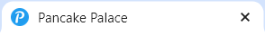

### Navigation bar

* Navigation Bar for telephones and Tablets.
* Provides user friendly navigation to enchance the user navigation and experience across various devices.

For mobile phone

For tablet, desktops and laptops

### Lower nav 

* Includes a lower navigation section with opening hours, location, newsletter and contact information.
* Offers essential information and enhancing user experience and facilitating easy communication with the business.

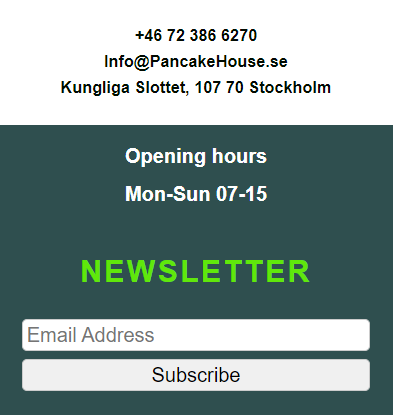

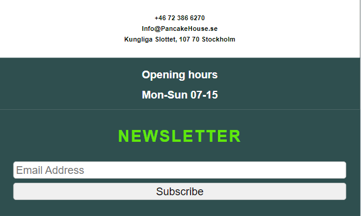

### Footer
* Contains icons linked to social media websites.
* Encourages social media engagement and interaction, extending the reach of the resturant.

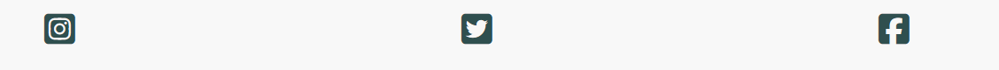

## Technologies

* HTML
    * The structure of the Website was developed using HTML as the main language.
* CSS
    * The Website was styled using custom CSS in an external file.
* Gitpod
    * The site was developed with Gitpod IDE
* GitHub
    * Source code is hosted on GitHub and deployed using Git Pages.
* Git 
    * Used to commit and push code during the development opf the Website
* Font Awesome
    * Icons obtained from https://fontawesome.com/ were used as the Social media links in the footer section. 
* Favicon.io
    * favicon files were created at https://favicon.io/logo-generator/

## Pages

### Home

* A home page with a beutiful picture that show that we serve pancakes, with a quick greeting and a modest statement.

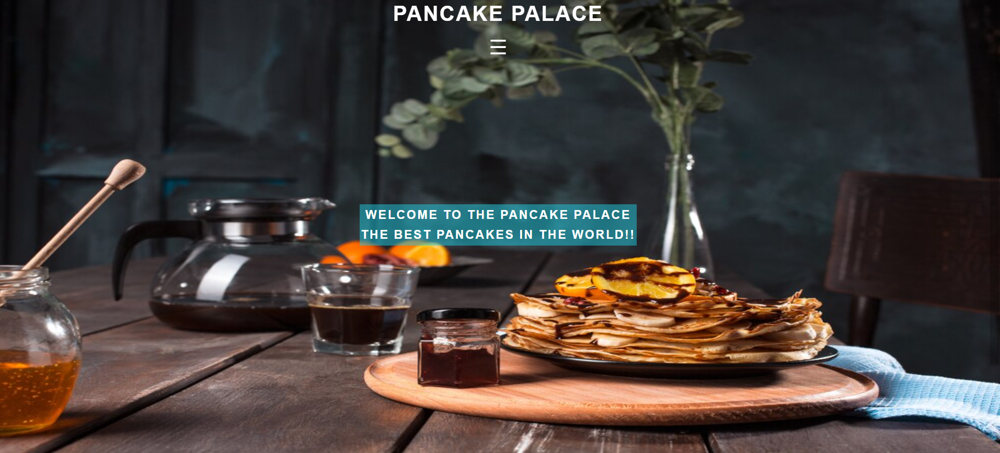

### Menu 

* A menu page with an abstract picture that shows you what you can order.
* Menu that has diffrent options ranging from Buffé to swedish classics.

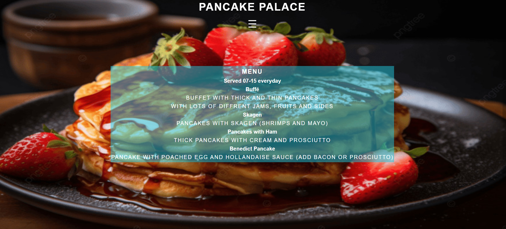

### About

* A small text about the family business when we opend how many we served and a greeting

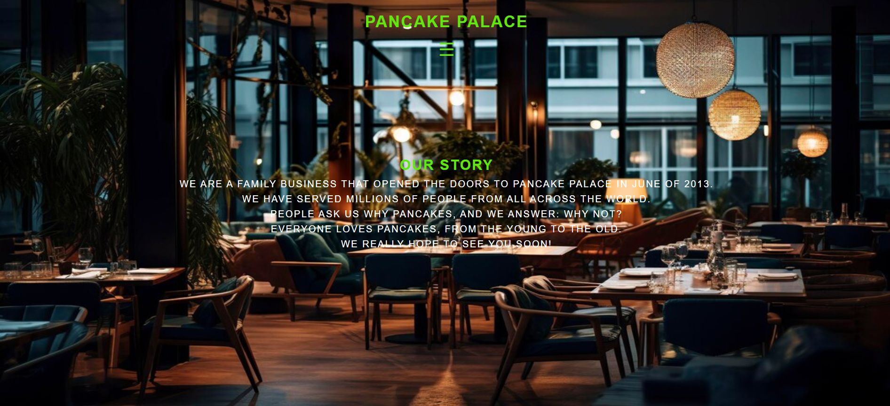

### Map

* Shows the restaurant location on an embeded Google Map

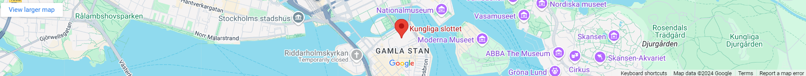

## Validation

### HTML-Validation
The W3C Markup Validation Service was used to validate the HTML of the website.

Home

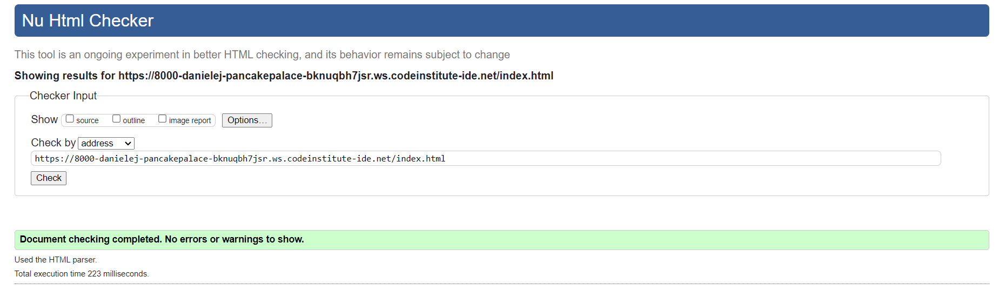

Menu

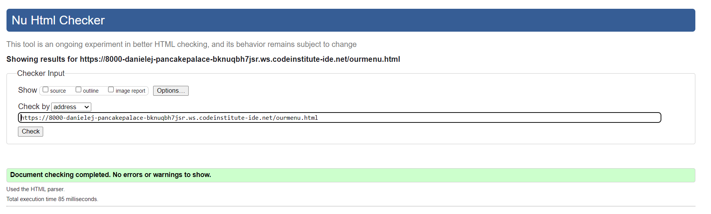

About

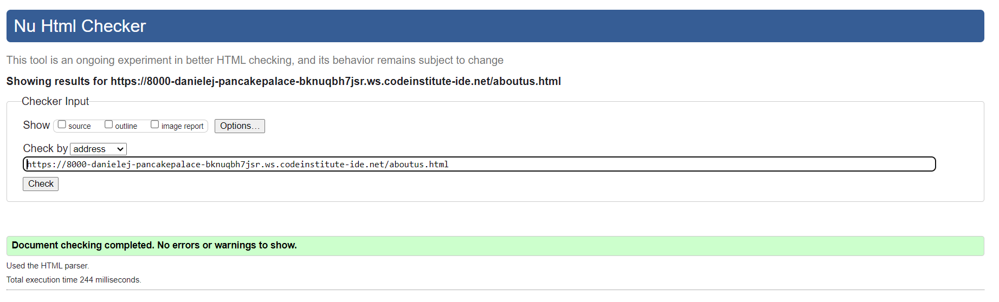>

### CSS-Validation
The W3C Jigsaw CSS Validation Service was used to validate the CSS of the website.

style.css

### Accessibility
The WAVE WebAIM web accessibility evaluation tool was used to ensure the website met high accessibility standards. All pages pass with 0 errors.

Home

Menu

About

### Performance 
Google Lighthouse in Google Chrome Developer Tools was used to test the performance of the website. 

Home

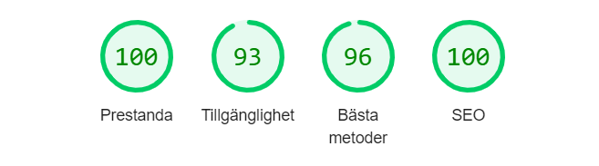

Menu

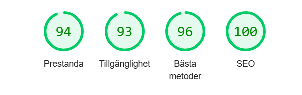

About

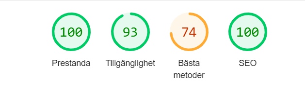

### Devices

### Functional Testing

| Test                                          | Steps                                    | Expected                    | Actual |
| --------------------------------------------- | ---------------------------------------- | --------------------------- | ------ |
| Nav links to correct pages                    | Press home/Our Menu/Aboutus              | Opens correct page          | Pass   |
| Nav links have underline on phone and tablet  | Click on link for each page              | Under line on everypage     | Pass   |
| Phone number link calls out, Phone and Tablet | Press the phonenumber on phone or tablet | Calls out                   | Pass   |
| Email Link on phone and Tablet                | Press email link on phone or tablet      | Opens Email provider        | Pass   |
| Newsletter subscription                       | Input correct email and hit Subscribe    | Takes you to Thank you page | Pass   |
| Social Media links                            | Press icons for Socialmedia platforms    | Opens new tab for each link | Pass   |

## Acknowledgements