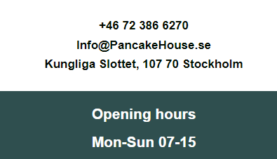
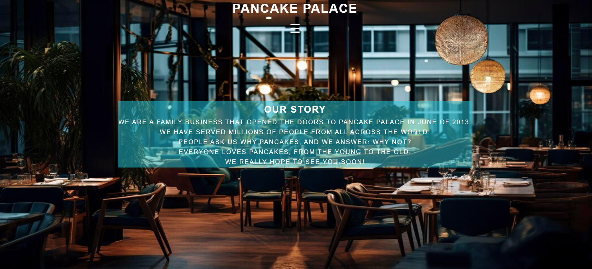
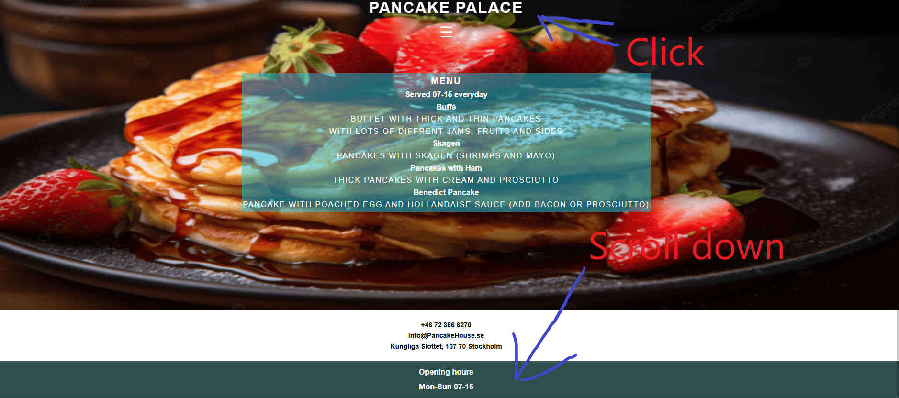

# The Pancake Palace
Welcome to the Pancake Palace! The resturant with the best pancakes in Stockholm!

(Developer: Daniel Elde-Johansson)

[Live webpage](https://daniele-j.github.io/Pancake-palace/)

## Table of Content
1. [Introduction](#Introduction)
2. [Project Goals](#project-goals)
    1. [User Goals](#user-goals)
    2. [Site Owner Goals](#site-owner-goals)
3. [User Experience](#user-experience)
    1. [Target Audience](#target-audience)
    2. [User Requirements and Expectations](#user-requirements-and-expectations)
    3. [User Stories](#user-stories)
4. [Features](#Features)
    1. [Favicon](#Favicon)
    2. [Navigation bar](#Navigation-bar)
    3. [Lowernav](#Lower-nav)
    4. [Footer](#Footer)
5. [Design](#design)
    1. [Design Choices](#design-choices)
    2. [Fonts](#fonts)
    3. [Structure](#structure) 
    4. [Wireframes](#Wireframes)  
6. [Technologies](#Technologies)
7. [Pages](#Pages)
    1. [Home](#Home)
    2. [Menu](#Menu)
    3. [About](#About)
    4. [Map](#map)
8. [Features](#features)
9. [Testing](#validation)
    1. [HTML Validation](#HTML-validation)
    2. [CSS Validation](#CSS-validation)
    3. [Accessibility](#accessibility)
    4. [Performance](#performance)
    5. [Devices](#Devices)
    6. [Browser compatibility](#browser-compatability)
    7. [Testing user stories](#Testing-user-stories)
10. [Functional Testing](#Functional-Testing)    
11. [Bugs](#Bugs)
12. [Deployment](#deployment)  
13. [Credits](#Credits)  
14. [Acknowledgements](#acknowledgements)

## Introduction

The Pancake Palace is located in the public resturant of the castle in Stockholm Sweden, We have been voted the best pancakes in stockholm for 5 years in a row!

## Project Goals

### User Goals

* Finding a restaurant that offers a welcoming atmosphere and good food.
* Find information about the restaurant.
* Find the location of the restaurant.

### Site Owner Goals

* Increase the number of customers.
* Provide a way for new and existing customers to contact the buissnes.
* Provide information about the business to customers.

## User Experience

### Target Audience
* People looking for a place to eat
* Tourists looking for a place to eat

### User Requirements and Expectations

* A simple and easy navigation system
* Quickly and easily find relevant information
* Links and functions that work as expected
* Accessibility
* A simple way to contact the business

#### User Stories

1. As a first time user, I want to know where the restaurant is located
2. As a first time user, I want to get a feel of what to expect at the restaurant

#### Returning User

3. As a returning user, I want to know the opening times
4. As a returning user, I want to find a phone number to call for reservation
5. As a returning user, I want to see the menu
6. As a returning user, I want to find the restaurant on social media
7. As a returning user, I want to get directions to the restaurant

#### Site Owner 
8. As the site owner, I want users to get to know the restaurant 
9. As the site owner, I want the users to be able to contact us

## Features

### Favicon
* A favicon has been implemented with the resturant logo and can be seen in the nav for each page
* This will allow the users to identify the website when they have multiple websites open

### Navigation bar

* Navigation Bar for telephones and Tablets.
* Provides user friendly navigation to enhance the user navigation and experience across various devices.

For mobile phone

For tablet, desktops and laptops

### Lower nav 

* Includes a lower navigation section with opening hours, location and contact information.
* Offers essential information and enhancing user experience and facilitating easy communication with the business.

### Footer
* Contains icons linked to social media websites.
* Encourages social media engagement and interaction, extending the reach of the resturant.

## Design

### Design Choices

The webpage was designed with the feeling a customer might get while dining at the restaurant.

### Fonts

Sans-serif Was used through the whole website to make everything look the same.

### Structure

The page is structured in a well know, recognizable, user friendly, and easy to learn way.
The website consists of three separate pages:
* A home page with a greeting
* A menu page with a menu
* A about page with a text about our origins.

### Wireframes

Home

About

Menu

## Technologies

* HTML
    * The structure of the Website was developed using HTML as the main language.
* CSS
    * The Website was styled using custom CSS in an external file.
* Gitpod
    * The site was developed with Gitpod IDE
* GitHub
    * Source code is hosted on GitHub and deployed using Git Pages.
* Git 
    * Used to commit and push code during the development of the Website
* Font Awesome
    * Icons obtained from https://fontawesome.com/ were used as the Social media links in the footer section. 
* Favicon.io
    * favicon files were created at https://favicon.io/logo-generator/

## Pages

### Home

* A home page with a beutiful picture that show that we serve pancakes, with a quick greeting and a modest statement.

### Menu 

* A menu page with a picture that shows you what you can order.
* Menu that has different options ranging from Buffé to swedish classics.

### About

* A small text about the family business when we opened how many we served and a greeting

### Map

* Shows the restaurant location on an embeded Google Map

## Validation

### HTML-Validation
The W3C Markup Validation Service was used to validate the HTML of the website.

Home

Menu

About

>

### CSS-Validation
The W3C Jigsaw CSS Validation Service was used to validate the CSS of the website.

style.css

### Accessibility
The WAVE WebAIM web accessibility evaluation tool was used to ensure the website met high accessibility standards. All pages pass.

Home

Menu

About

### Performance 
Google Lighthouse in Google Chrome Developer Tools was used to test the performance of the website. 

Home

Menu

About

### Devices

The website was tested on the following devices:
* Iphone 16 pro max
* Iphone 15
* Samsung galaxy s24

### Browser compatability
The website was tested on the following browsers:
- Google Chrome
- Firefox
- Microsoft Egde

### Testing user stories

1. As a first time user, I want to know where the restaurant is located

| **Feature** | **Action** | **Expected Result** | **Actual Result** |
|-------------|------------|---------------------|-------------------|
| Map | Navigate to the About us page, find the Google Map | find a map showing the location of the restaurant | Works as expected |
| Footer - contact information section | On home and menu page scroll down to the footer | Find the address of the restaurant | Works as expected |

Screenshots

2. As a first time user, I want to know the menu

| **Feature** | **Action** | **Expected Result** | **Actual Result** |
|-------------|------------|---------------------|-------------------|
| Menu | Navigate to the Menu page | See menu page | Works as expected |

Screenshots

3. As a returning user, I want to know the opening times

| **Feature** | **Action** | **Expected Result** | **Actual Result** |
|-------------|------------|---------------------|-------------------|
| Footer - opening times section | On any page scroll to the footer | See opening times | Works as expected |

Screenshots

 

4. As a returning user, I want to find a phone number to call for reservation

| **Feature** | **Action** | **Expected Result** | **Actual Result** |
|-------------|------------|---------------------|-------------------|
| Footer - contact information section | On home and menu page scroll to the footer | See phone number | Works as expected |
| Info Box | On home and menu scroll to the footer | See phone number | Works as expected |

Screenshots

 

5. As a returning user, I want to see the menu

| **Feature** | **Action** | **Expected Result** | **Actual Result** |
|-------------|------------|---------------------|-------------------|
| Menu | Navigate to the menu page | Read the menu | Works as expected |

Screenshots

6. As a returning user, I want to find the restaurant on social media

| **Feature** | **Action** | **Expected Result** | **Actual Result** |
|-------------|------------|---------------------|-------------------|
| Footer - social media section | On any page scroll to the bottom | Click on social media links | Works as expected | 

Screenshots

7. As a returning user, I want to get directions to the restaurant

| **Feature** | **Action** | **Expected Result** | **Actual Result** |
|-------------|------------|---------------------|-------------------|
| Map | Navigate to the About Us page, locate the map and click on map | See directions to the restaurant on Goole Maps | Works as expected |

Screenshots

8. As the site owner, I want users to get to know the restaurant 

| **Feature** | **Action** | **Expected Result** | **Actual Result** |
|-------------|------------|---------------------|-------------------|
| About Us | Navigate to About page | See information about the restaurant | Works as expected |

Screenshots

9. As the site owner, I want the users to be able to contact us

| **Feature** | **Action** | **Expected Result** | **Actual Result** |
|-------------|------------|---------------------|-------------------|
| Contact | Navigate to Home or Menu and scroll down to find us | Find the phone number and address | Works as expectd |
| Info Box | Navigate to Home or Menu and scroll down to find us | Find the phone number and address | Works as expected |
| Footer - contact information section | On home and menu page scroll down to the footer | Find the phone number and address | Works as expected |

Screenshots

## Functional Testing

| Test                                          | Steps                                    | Expected                    | Actual |
| --------------------------------------------- | ---------------------------------------- | --------------------------- | ------ |
| Nav links to correct pages                    | Press home/ Menu/ About                  | Opens correct page          | Pass   |
| Phone number link calls out, Phone and Tablet | Press the phonenumber on phone or tablet | Calls out                   | Pass   |
| Email Link on phone and Tablet                | Press email link on phone or tablet      | Opens Email provider        | Pass   |
| Social Media links                            | Press icons for Socialmedia platforms    | Opens new tab for each link | Pass   |

## Bugs

| **Bug** | **Fix** |
| ----------- | ----------- |
| Map was not centerd or in its place | Changed dimensions on map to make it right|
| Social links were not visable | had to delete and change back colors|
| Header looked crammed up in phones | Added padding to css |

## Deployment

* The site was deployed to GitHub pages. The steps to deploy are as follows: 
  1. In the GitHub repository, navigate to the Settings tab 
  2. From the menu on left select 'Pages'
  3. From the source section drop-down menu, select the Branch: main
  4. Click 'Save'
  5. A live link will be displayed in a green banner when published successfully. 

* You can clone the repository by following these steps:
    1. Go to the GitHub repository 
    2. Locate the Code button above the list of files and click it 
    3. Select if you prefere to clone using SSH, HTTPS, or Github CLI and click the copy button to copy the URL to your clipboard
    4. Open Git Bash
    5. Change the current working directory to the one where you want the cloned directory
    6. Type git clone and paste the URL from the clipboard ($ git clone https://github.com/YOUR-USERNAME/YOUR-REPOSITORY)
    7. Press Enter to create your local clone.  

## Credits 

* [Ana Runje] (https://github.com/4n4ru/CI_MS1_BodelschwingherHof) for Readme insparation.

## Acknowledgements

I would like to take the opportunity to thank:
* My mentor Mo Shami for his feedback, advice, and support.
* My Wife Agnes for her support, advice and help with the baby so i can take time for my project.