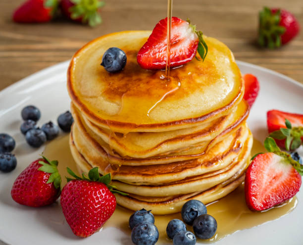

# The Pancake Palace

Welcome to the Pancake Palace! The resturant with the best pancakes in Stockholm!

## Introduction

The Pancake Palace is located in the public resturant of the castle in Stockholm Sweden, We have been voted the best pancakes in stockholm for 5 years in a row!

## Features

#### Favicon
* A favicon has been implemented with the resturant logo and can be seen in the nav for each page
* This will allow the users to identify the website when they have multiple websites open

### Navigation bar

* Navigation Bar for telephones and Tablets.
* Provides user friendly navigation to enchance the user navigation and experience across various devices.

For mobile phone

For tablet, desktops and laptops

### Hero image

* A delicious picture of a pancake that will make the user excited.

### Lower navigation with opening hours, location, newsletter and contact information

* Includes a lower navigation section with opening hours, location, newsletter and contact information.
* Offers essential information and enhancing user experience and facilitating easy communication with the business.

### Footer
* Contains icons linked to social media websites.
* Encourages social media engagement and interaction, extending the reach of the resturant.